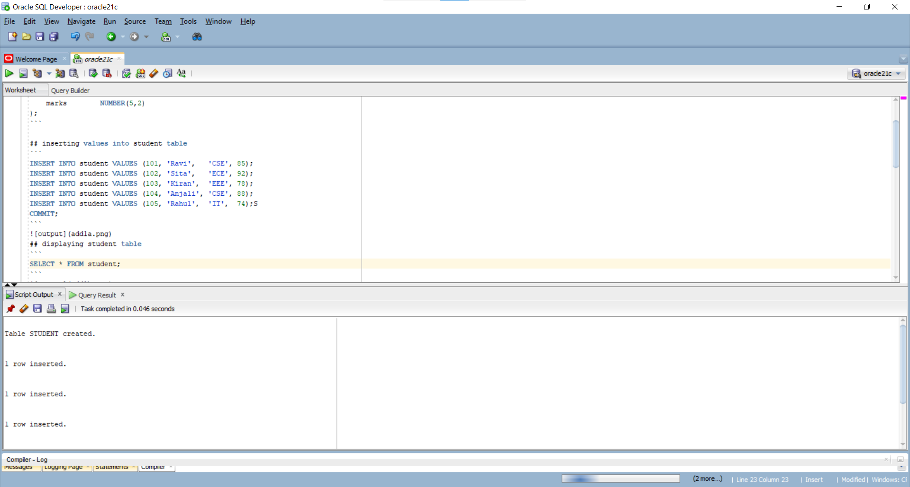
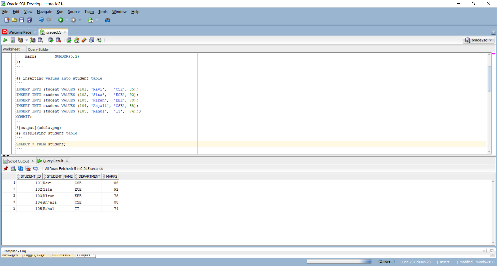
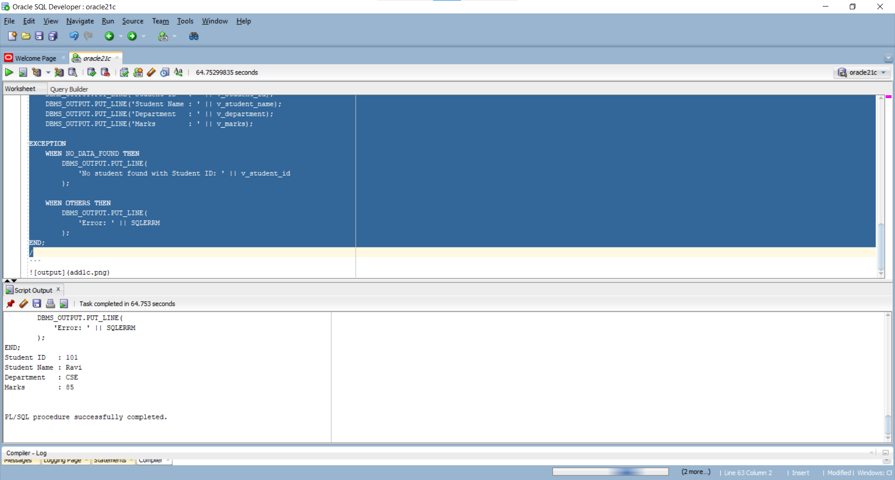

## creating student table;
```
CREATE TABLE student (
    student_id   NUMBER(5) PRIMARY KEY,
    student_name VARCHAR2(50),
    department   VARCHAR2(30),
    marks        NUMBER(5,2)
);
```

## inserting values into student table
```
INSERT INTO student VALUES (101, 'Ravi',   'CSE', 85);
INSERT INTO student VALUES (102, 'Sita',   'ECE', 92);
INSERT INTO student VALUES (103, 'Kiran',  'EEE', 78);
INSERT INTO student VALUES (104, 'Anjali', 'CSE', 88);
INSERT INTO student VALUES (105, 'Rahul',  'IT',  74);
COMMIT;
```

## displaying student table
```
SELECT * FROM student;
```

## PL/SQL code
```
SET SERVEROUTPUT ON;

DECLARE
    v_student_id   student.student_id%TYPE;
    v_student_name student.student_name%TYPE;
    v_department   student.department%TYPE;
    v_marks        student.marks%TYPE;

BEGIN
    -- Accept Student ID from the user
    v_student_id := &student_id;

    -- Retrieve student details
    SELECT student_name, department, marks
    INTO v_student_name, v_department, v_marks
    FROM student
        );

 WHERE student_id = v_student_id;
            'Error: ' || SQLERRM
    WHEN OTHERS THEN
        DBMS_OUTPUT.PUT_LINE(


        );
    -- Display student details
        DBMS_OUTPUT.PUT_LINE(
            'No student found with Student ID: ' || v_student_id
    EXCEPTION
    WHEN NO_DATA_FOUND THEN
    DBMS_OUTPUT.PUT_LINE('Student ID   : ' || v_student_id);

   END;
    /


