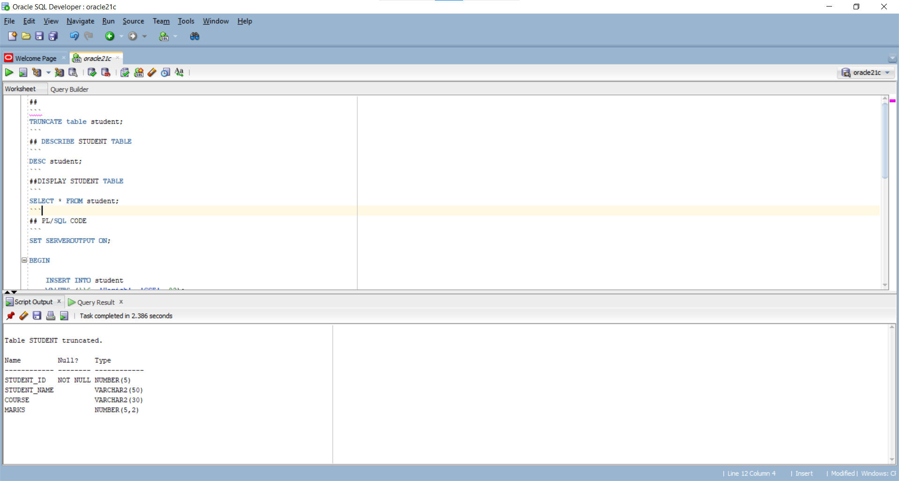
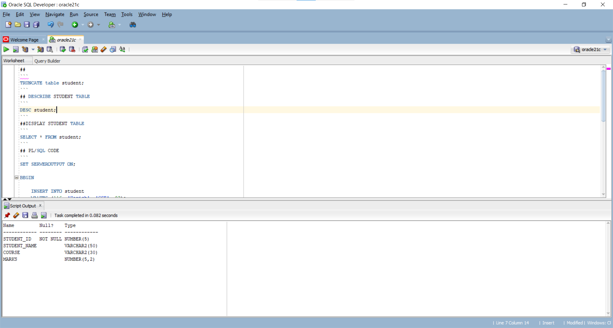
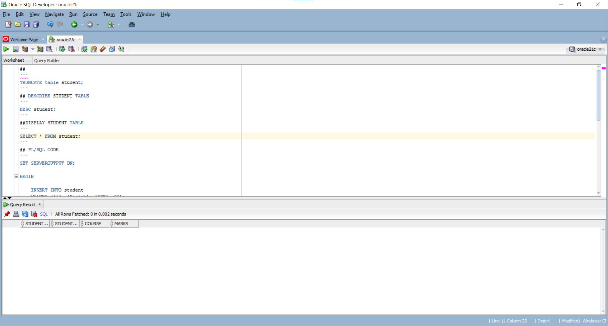
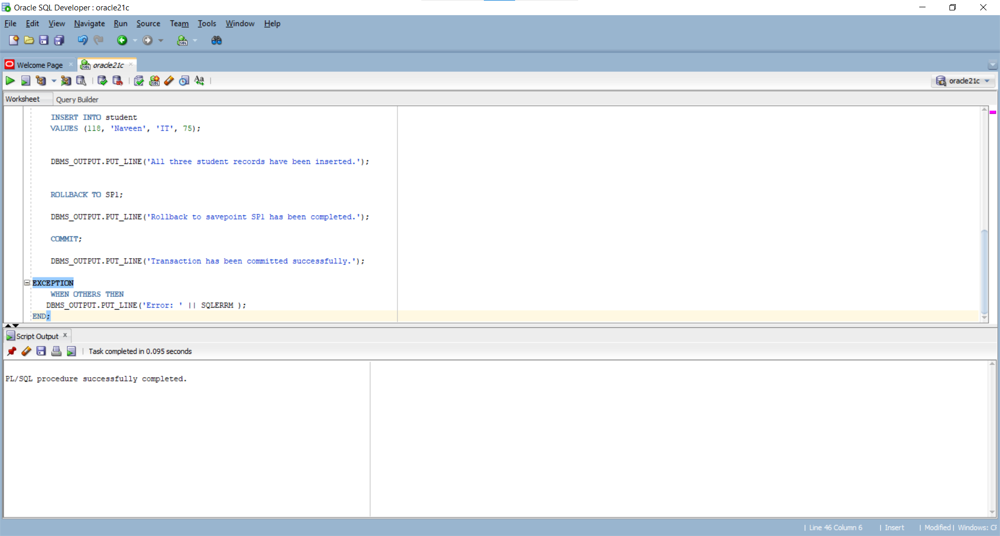

##
```
TRUNCATE table student;
```


## DESCRIBE STUDENT TABLE
```
DESC student;
```


##DISPLAY STUDENT TABLE
```
SELECT * FROM student;
```


## PL/SQL CODE
```
SET SERVEROUTPUT ON;

BEGIN

    INSERT INTO student
    VALUES (116, 'Harish', 'CSE', 82);


    INSERT INTO student
    VALUES (117, 'Lakshmi', 'ECE', 90);

    SAVEPOINT SP1;

    INSERT INTO student
    VALUES (118, 'Naveen', 'IT', 75);


    DBMS_OUTPUT.PUT_LINE('All three student records have been inserted.');


    ROLLBACK TO SP1;

    DBMS_OUTPUT.PUT_LINE('Rollback to savepoint SP1 has been completed.');

    COMMIT;

    DBMS_OUTPUT.PUT_LINE('Transaction has been committed successfully.');

    EXCEPTION
    WHEN OTHERS THEN
     
    DBMS_OUTPUT.PUT_LINE('Error:'|| SQLERRM);
END;
/
```


