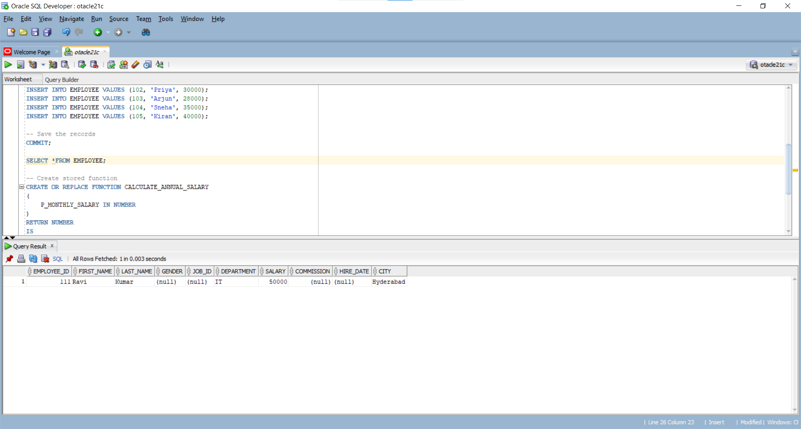
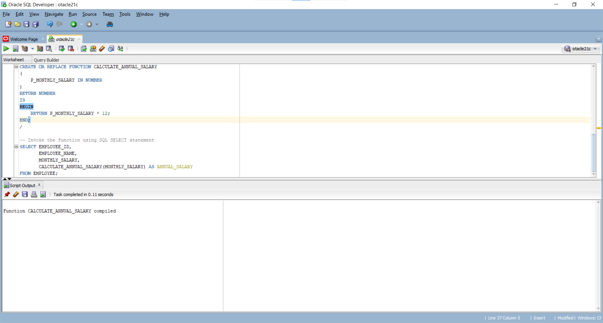
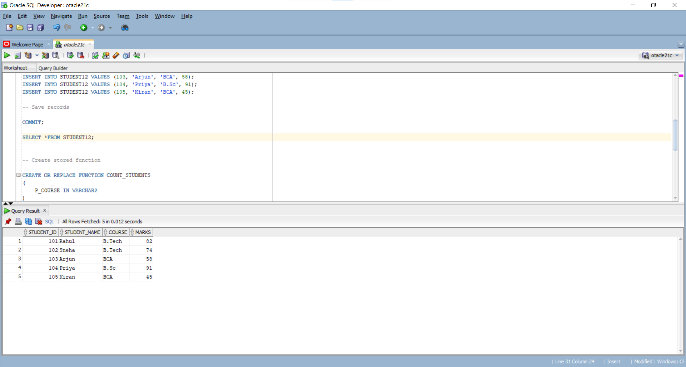
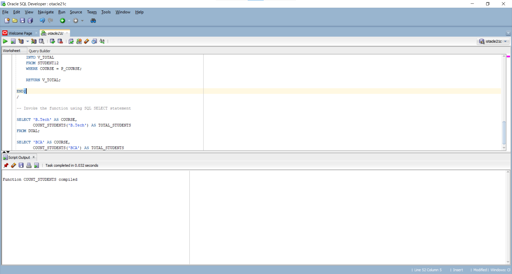
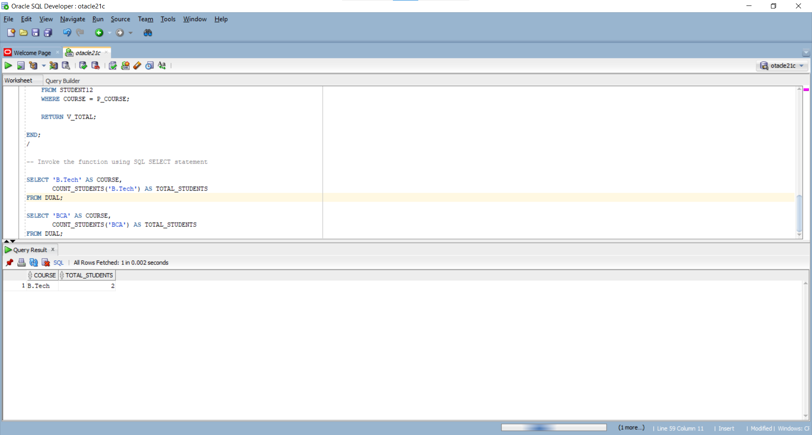
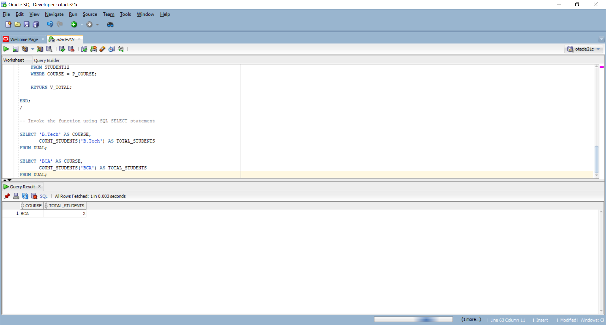
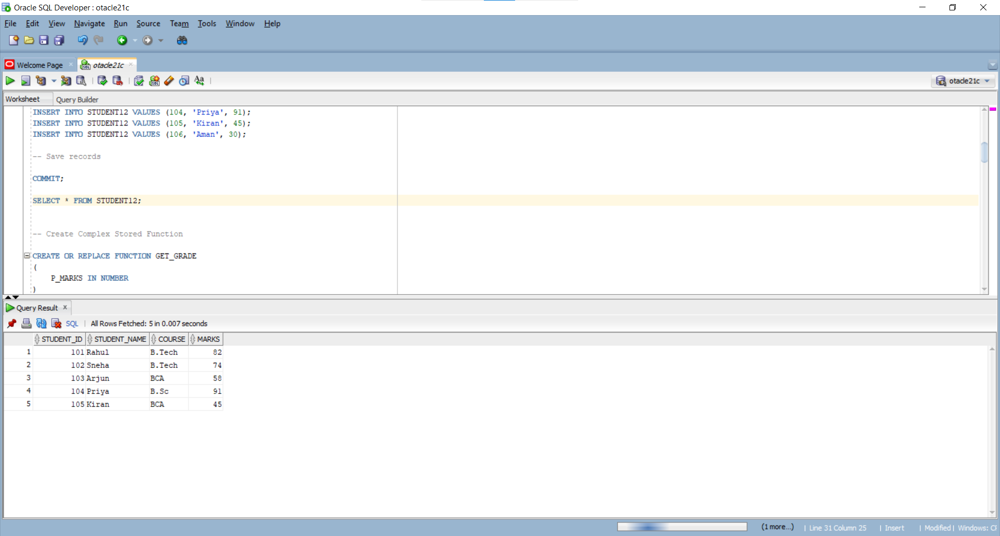
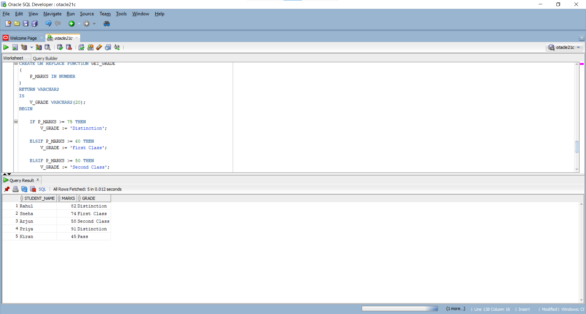

    -- PROGRAM 1: CALCULATE ANNUAL SALARY USING A STORED FUNCTION
     ``
    SET SERVEROUTPUT ON;

     -- Create EMPLOYEE table
    CREATE TABLE EMPLOYEE
    (
    EMPLOYEE_ID NUMBER(4) PRIMARY KEY,
    EMPLOYEE_NAME VARCHAR2(30),
    MONTHLY_SALARY NUMBER(10,2)
    );

    -- Insert sample employee records
    INSERT INTO EMPLOYEE VALUES (101, 'Ravi', 25000);
    INSERT INTO EMPLOYEE VALUES (102, 'Priya', 30000);
    INSERT INTO EMPLOYEE VALUES (103, 'Arjun', 28000);
    INSERT INTO EMPLOYEE VALUES (104, 'Sneha', 35000);
    INSERT INTO EMPLOYEE VALUES (105, 'Kiran', 40000);

    -- Save the records
    COMMIT;

 

    -- Create stored function
    CREATE OR REPLACE FUNCTION CALCULATE_ANNUAL_SALARY
    (
    P_MONTHLY_SALARY IN NUMBER
    )
    RETURN NUMBER
    IS
    BEGIN
    RETURN P_MONTHLY_SALARY * 12;
    END;
    /

   
    -- Invoke the function using SQL SELECT statement
    SELECT EMPLOYEE_ID,
       EMPLOYEE_NAME,
       MONTHLY_SALARY,
       CALCULATE_ANNUAL_SALARY(MONTHLY_SALARY) AS ANNUAL_SALARY
    FROM EMPLOYEE;

    EXPERIMENT-7(b)
    -- PROGRAM 2: FIND THE TOTAL NUMBER OF STUDENTS IN A COURSE

    SET SERVEROUTPUT ON;

    -- Create STUDENT12 table

    CREATE TABLE STUDENT12
    (
    STUDENT_ID NUMBER(4) PRIMARY KEY,
    STUDENT_NAME VARCHAR2(30),
    COURSE VARCHAR2(20),
    MARKS NUMBER(3)
    );

    -- Insert sample student records

    INSERT INTO STUDENT12 VALUES (101, 'Rahul', 'B.Tech', 82);
    INSERT INTO STUDENT12 VALUES (102, 'Sneha', 'B.Tech', 74);
    INSERT INTO STUDENT12 VALUES (103, 'Arjun', 'BCA', 58);
    INSERT INTO STUDENT12 VALUES (104, 'Priya', 'B.Sc', 91);
    INSERT INTO STUDENT12 VALUES (105, 'Kiran', 'BCA', 45);

    -- Save records

    COMMIT;
 
   

    -- Create stored function

    CREATE OR REPLACE FUNCTION COUNT_STUDENTS
    (
    P_COURSE IN VARCHAR2
    )
    RETURN NUMBER
    IS
    V_TOTAL NUMBER;
    BEGIN

    SELECT COUNT(*)
    INTO V_TOTAL
    FROM STUDENT12
    WHERE COURSE = P_COURSE;

    RETURN V_TOTAL;

    END;
    /

   

    -- Invoke the function using SQL SELECT statement

    SELECT 'B.Tech' AS COURSE,
       COUNT_STUDENTS('B.Tech') AS TOTAL_STUDENTS
    FROM DUAL;

   

    SELECT 'BCA' AS COURSE,
       COUNT_STUDENTS('BCA') AS TOTAL_STUDENTS
    FROM DUAL;

   

    -- PROGRAM 3: DETERMINE STUDENT GRADE USING A COMPLEX STORED FUNCTION

    SET SERVEROUTPUT ON;

    -- Create STUDENT12 table

    CREATE TABLE STUDENT12
    (
    STUDENT_ID NUMBER(4) PRIMARY KEY,
    STUDENT_NAME VARCHAR2(30),
    MARKS NUMBER(3)
    );

    -- Insert sample student records

    INSERT INTO STUDENT12 VALUES (101, 'Rahul', 82);
    INSERT INTO STUDENT12 VALUES (102, 'Sneha', 74);
    INSERT INTO STUDENT12 VALUES (103, 'Arjun', 58);
    INSERT INTO STUDENT12 VALUES (104, 'Priya', 91);
    INSERT INTO STUDENT12 VALUES (105, 'Kiran', 45);
    INSERT INTO STUDENT12 VALUES (106, 'Aman', 30);

    -- Save records

    COMMIT;

   

    -- Create Complex Stored Function

    CREATE OR REPLACE FUNCTION GET_GRADE
    (
    P_MARKS IN NUMBER
     )
    RETURN VARCHAR2
    IS
    V_GRADE VARCHAR2(20);
    BEGIN

    IF P_MARKS >= 75 THEN
        V_GRADE := 'Distinction';

    ELSIF P_MARKS >= 60 THEN
        V_GRADE := 'First Class';

    ELSIF P_MARKS >= 50 THEN
        V_GRADE := 'Second Class';

    ELSIF P_MARKS >= 35 THEN
        V_GRADE := 'Pass';

    ELSE
        V_GRADE := 'Fail';

    END IF;

    RETURN V_GRADE;

    END;
    /

    -- Invoke the function using SQL SELECT statement

    SELECT STUDENT_NAME,
       MARKS,
       GET_GRADE(MARKS) AS GRADE
    FROM STUDENT12;

   
